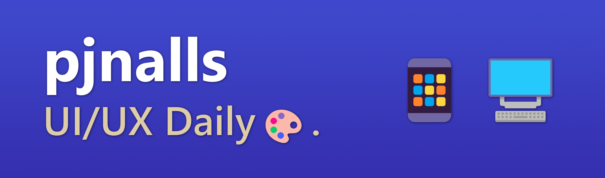

 

## Hi 👋, I'm pjnalls.

 

I am a self-described UX engineer currently working as a UI consultant and dedicating most of my time toward design and development of user interfaces. 
I'm passionate about coding UI in React, Next.js, Angular, and Tailwind CSS and enjoy using pure HTML, modular SCSS, and ES6+ JavaScript for smaller frontend projects.

 

> A great specialist is also a good generalist.

👆 I think it's important to have a broad and deep understanding of frontends, aesthetics as well as performance of a web app, and empathetic as well as systematic forms of good UX facilitated by great UI.

 

 

 

